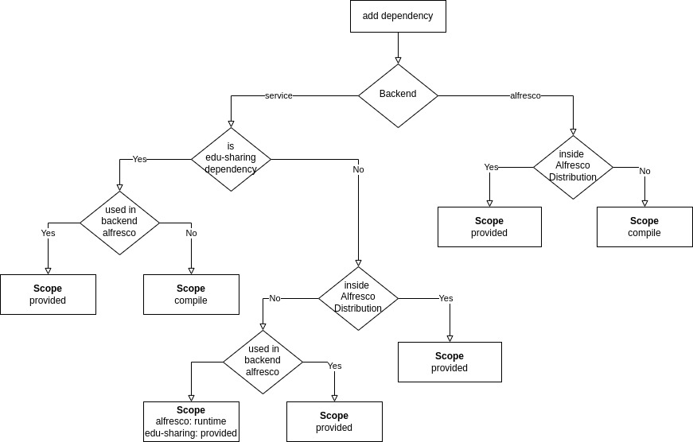

# edu-sharing community repository
===========================

The edu-sharing open-source project started in 2007 to develop networked E-Learning environments for managing and
sharing educational contents inter-organisationally.

Documentation
-------------
More information can be found on the [homepage](http://www.edu-sharing.com).

Or visit the edu-sharing [documentation](http://docs.edu-sharing.com/confluence/edp).

Where can I get the latest release?
-----------------------------------
You can download source and binaries from
our [artifact repository](https://artifacts.edu-sharing.com).

We also offer a ready-to-use docker-compose & kubernetes package for each release. Ccheck out the github releases page [here](https://github.com/edu-sharing/edu-sharing-projects-community/releases).

Contributing
------------
For contribution on a regular basis please visit our [community site](http://edu-sharing-network.org/?lang=en).

Security Issues
---------------
If you found something which might could be a vulnerability or a security issue, please contact us first instead of
making a public issue. This can help us tracking down the issue first and may provide patches beforehand.

Please provide such concerns via mail to security@edu-sharing.com

Thanks!

Dependency Management
---------------------

Rule of thumb:
Dependencies of all third party libraries used by edu-sharing will be specified in the alfresco class path under backend/alfresco/module.
This will prevent dependency conflicts inside the application of edu-sharing and alfresco.

Inside alfresco:
scope: provided -> if the library comes with the alfresco distribution
scope: runtime  -> imported for use in edu-sharing but not in alfresco
scope: compile  -> imported for use in alfresco or edu-sharing

Inside edu-sharing:
scope: provided -> always for all third party libraries
scope: compile  -> only edu-sharing internals

 